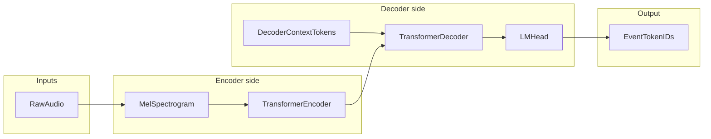
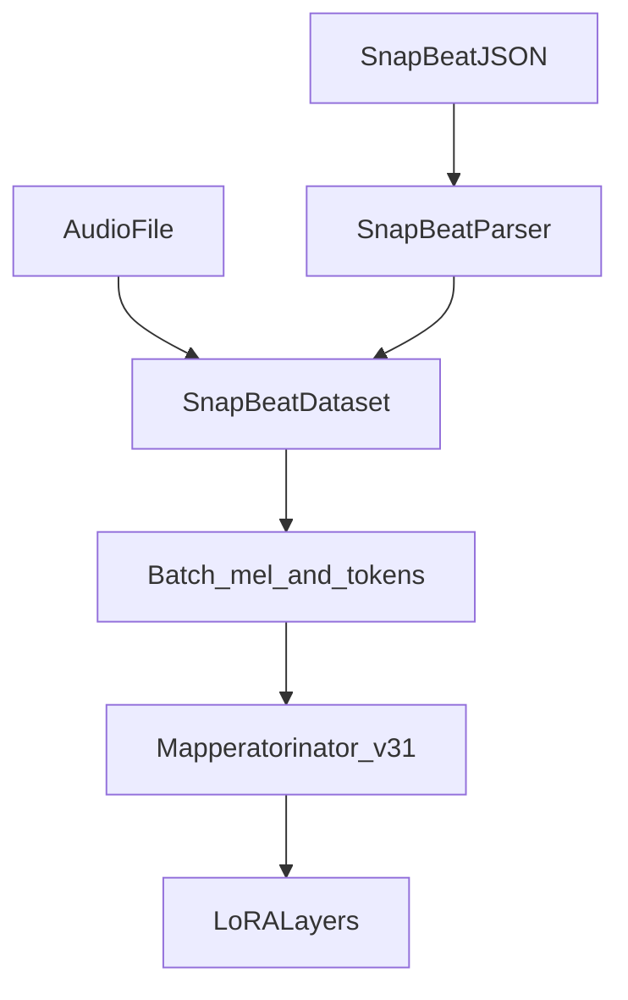

# Educational architecture guide: Mapperatorinator and SnapBeat LoRA

This document is written for coursework and self-study in machine learning. It explains the **Mapperatorinator** stack from basic ideas through the **SnapBeat** LoRA fine-tuning setup used in this repository.

Related operational docs: [SNAPBEAT_FINETUNING.md](SNAPBEAT_FINETUNING.md), [SNAPBEAT_TRAINING_RESULTS.md](SNAPBEAT_TRAINING_RESULTS.md).

---

## 1. Problem statement and thesis hook

**Supervised sequence modeling.** The model learns a conditional distribution over **discrete chart tokens** given **audio**:

\[
P(\text{tokens} \mid \text{audio}) \approx \prod_t P(x_t \mid x_{<t}, \text{audio}).
\]

Training minimizes **cross-entropy** on next-token prediction. The chart is not predicted as raw JSON or pixels; it is predicted as a **sequence of event symbols** (timing, columns, note types, and so on) that downstream code can turn into `.osu` or SnapBeat JSON.

**Why this matters for a final project:** you can frame the work as **structured prediction from audio**—the same family as speech recognition (audio → text) or music transcription, but with a **domain-specific tokenizer** for rhythm games.

---

## 2. High-level system architecture

### 2.1 Data flow



- **Encoder** consumes a time series of acoustic features (mel spectrogram frames).
- **Decoder** is **autoregressive**: at each step it sees previous tokens (and optional **context** tokens) and predicts the next token.
- **LM head** maps hidden states to logits over the **event vocabulary**.

### 2.2 What the code actually instantiates

The class **`Mapperatorinator`** ([`osuT5/osuT5/model/modeling_mapperatorinator.py`](../osuT5/osuT5/model/modeling_mapperatorinator.py)) combines:

1. A **`MelSpectrogram`** module (when not using raw wave mode) to turn waveform chunks into mel frames.
2. A **Hugging Face seq2seq backbone** chosen by `get_backbone_model`:

```16:34:osuT5/osuT5/model/modeling_mapperatorinator.py
def get_backbone_model(config: MapperatorinatorConfig):
    name = config.backbone_model_name
    b_config = config.backbone_config

    if name.startswith("google/t5"):
        from transformers import T5Config, T5ForConditionalGeneration
        if isinstance(b_config, dict):
            b_config = T5Config(**b_config)
        model_cls = T5ForConditionalGeneration
    elif name.startswith("OliBomby/nwhisper"):
        from .custom_transformers import NWhisperConfig, NWhisperForConditionalGeneration
        if isinstance(b_config, dict):
            b_config = NWhisperConfig(**b_config)
        model_cls = NWhisperForConditionalGeneration
    elif name.startswith("Tiger14n/ropewhisper"):
        from .custom_transformers import RoPEWhisperConfig, RoPEWhisperForConditionalGeneration
        if isinstance(b_config, dict):
            b_config = RoPEWhisperConfig(**b_config)
        model_cls = RoPEWhisperForConditionalGeneration
```

**Important for `OliBomby/Mapperatorinator-v31`:** training config [`configs/train/v31.yaml`](../configs/train/v31.yaml) pulls in [`configs/model/whisper_small_v2.yaml`](../configs/model/whisper_small_v2.yaml), which sets `name: 'Tiger14n/ropewhisper-small'`. So **v31 is a RoPE Whisper–family encoder–decoder**, not the legacy custom T5 implementation under [`osuT5/osuT5/model/custom_transformers/t5.py`](../osuT5/osuT5/model/custom_transformers/t5.py) (that path serves other backbone names).

The forward path applies the spectrogram, optionally concatenates **conditioning** embeddings along the feature axis, then passes features to the backbone:

```172:209:osuT5/osuT5/model/modeling_mapperatorinator.py
        if encoder_outputs is None and frames is not None:
            if not self.input_raw_wave:
                frames = self.spectrogram(frames)  # (N, L, M)
                frames = frames.to(dtype=self.transformer.dtype)  # Ensure correct dtype for the model
                conds = []

                if self.do_style_embed:
                    style_embedding = self.style_embedder(beatmap_idx)  # (N, D)
                    style_embedding = style_embedding.unsqueeze(1).repeat((1, frames.shape[1], 1))
                    conds.append(style_embedding)
                if self.do_difficulty_embed:
                    difficulty_embedding = self.difficulty_embedder(difficulty)
                    conds.append(difficulty_embedding)
                if self.do_mapper_embed:
                    mapper_embedding = self.mapper_embedder(mapper_idx)
                    conds.append(mapper_embedding)
                if self.do_song_position_embed:
                    song_position_embedding = self.song_pos_embedder(song_position)
                    conds.append(song_position_embedding)

                conds_expanded = [c.unsqueeze(1).expand((-1, frames.shape[1], -1)) for c in conds]
                inputs_embeds = torch.concatenate([frames] + conds_expanded, dim=-1)

            if self.project_encoder_input:
                inputs_embeds = self.encoder_embedder(inputs_embeds) if inputs_embeds is not None else None

            if self.input_raw_wave:
                inputs["input_values"] = frames.reshape(frames.shape[0], -1)
            elif self.input_features:
                inputs["input_features"] = torch.swapaxes(inputs_embeds, 1, 2) if inputs_embeds is not None else None
            else:
                inputs["inputs_embeds"] = inputs_embeds

        if self.embed_decoder_input:
            inputs["decoder_inputs_embeds"] = self.decoder_embedder(decoder_input_ids)
            del inputs["decoder_input_ids"]

        output = self.transformer.forward(**inputs)
```

For **`whisper_small_v2`**, `input_features: true` and `project_encoder_input: false`, so mel (+ optional conds) are passed as **`input_features`** after the channel/time swap.

---

## 3. From fundamentals to advanced concepts

### 3.1 Supervised learning and the generative view

You have pairs \((\text{audio}, \text{token sequence})\). The network parameters \(\theta\) are tuned so that the predicted token distribution matches the ground truth under **cross-entropy**. The implementation uses a **per-class weight vector** so **rhythm-related tokens** contribute more to the loss (configurable `rhythm_weight`), reflecting that timing mistakes are particularly harmful for charts:

```130:137:osuT5/osuT5/model/modeling_mapperatorinator.py
        class_weights = torch.ones(config.vocab_size)
        class_weights[config.rhythm_token_start:config.rhythm_token_end] = config.rhythm_weight
        self.loss_fn = nn.CrossEntropyLoss(
            weight=class_weights,
            reduction="none",
            ignore_index=LABEL_IGNORE_ID,
            label_smoothing=config.label_smoothing
        )
```

### 3.2 Discrete sequences and tokenization

Beatmaps are **event lists** (circle, hold, time shift, mania column, …). The **`Tokenizer`** maps each event type and value to an integer ID ([`osuT5/osuT5/tokenizer.py`](../osuT5/osuT5/tokenizer.py)). **Time** is quantized: `MILISECONDS_PER_STEP = 10`, so one token step corresponds to **10 ms** when encoding and decoding `TIME_SHIFT` ([`osuT5/osuT5/tokenizer.py`](../osuT5/osuT5/tokenizer.py), [`osuT5/osuT5/inference/processor.py`](../osuT5/osuT5/inference/processor.py)).

### 3.3 Autoregressive modeling

The decoder models \(P(x_t \mid x_{<t}, \text{encoder output})\). During **training**, **teacher forcing** exposes the decoder to the true prefix; the loss is applied on **shifted** labels. During **inference**, the model typically conditions on **its own** previous predictions, which can drift (exposure bias)—a standard topic in seq2seq generation.

### 3.4 Encoder–decoder structure and cross-attention

- **Encoder:** reads the full mel sequence and produces a sequence of hidden vectors.
- **Decoder:** uses **self-attention** over past tokens (with a causal mask) and **cross-attention** to the encoder states so each prediction can depend on **when** something happens in the audio.

### 3.5 Transformers (concise)

- **Self-attention** computes weighted combinations of values from all positions (masked in the decoder).
- **Multi-head attention** runs several attentions in parallel.
- **Feed-forward (MLP) blocks** apply position-wise nonlinearities after attention.

**Whisper-style inductive bias:** speech models are already trained for **acoustic input → discrete output**; this project reuses that family for **acoustic input → chart tokens**.

### 3.6 Spectrograms and mel scale (audio ML)

- **STFT:** splits the waveform into overlapping windows and Fourier-transforms each → a time–frequency representation.
- **Mel filterbank:** compresses frequency bins into **mel bands** aligned with human pitch perception.
- **Result:** each time frame is a vector of length **`n_mels`** (80 in [`configs/model/whisper_small_v2.yaml`](../configs/model/whisper_small_v2.yaml)).

### 3.7 Conditioning and SnapBeat-specific context

Many training configs inject **metadata** (difficulty, mapper, …) as extra embeddings broadcast across time. **SnapBeat** disables most osu!-specific prefix tokens and instead uses **`context_types`** so **timing context** (beat grid / timing events) can be placed in the **decoder input** before the map tokens. That is configured in [`configs/train/snapbeat_lora.yaml`](../configs/train/snapbeat_lora.yaml) and implemented in [`osuT5/osuT5/dataset/snapbeat_parser.py`](../osuT5/osuT5/dataset/snapbeat_parser.py) (`parse_timing`) and [`osuT5/osuT5/dataset/snapbeat_dataset.py`](../osuT5/osuT5/dataset/snapbeat_dataset.py). See [SNAPBEAT_FINETUNING.md](SNAPBEAT_FINETUNING.md) for the end-to-end pipeline table.

**Why this single mechanism matters more than it looks.** In the experiment log, enabling the `context_types: timing→map` route on its own (Run 7 → Run 8) raised exact timing accuracy from ~64.6% to ~75.3%—**+10.7 pp from one config change**, larger than any other intervention in the project's history. Four subsequent single-axis sweeps (loss weighting, regularization, LoRA rank, schedule) each moved the needle by less than ±0.8 pp. The didactic takeaway is general: **for structured prediction on temporal data, giving the autoregressive decoder explicit access to the relevant time grid is often higher-leverage than scaling parameters, regularization, or schedule**. Where you place the inductive bias matters more than how hard you tune around it.

### 3.8 Transfer learning and LoRA

- **Transfer learning:** initialize from **`OliBomby/Mapperatorinator-v31`** (pretrained on large osu! chart data), then adapt weights toward SnapBeat charts.
- **LoRA (Low-Rank Adaptation):** instead of updating full weight matrices \(W\), train low-rank matrices \(A, B\) so the effective update is small-rank. Fewer trainable parameters → less GPU memory and often **stable** fine-tuning.

**Where LoRA is attached:** [`osuT5/train.py`](../osuT5/train.py) uses PEFT when `enable_lora` is true:

```74:81:osuT5/train.py
    if args.enable_lora:
        from peft import LoraConfig, get_peft_model
        lora_config = LoraConfig(**args.lora)
        model = get_peft_model(model, lora_config)
        # lora_params = {n: p for n, p in model.named_parameters() if "lora" in n}
        # for n, p in lora_params.items():
        #     print(n, p.sum())
        model.print_trainable_parameters()
```

**SnapBeat LoRA targets** (attention projections **and** MLP `fc1`/`fc2`) and hyperparameters live in [`configs/train/snapbeat_lora.yaml`](../configs/train/snapbeat_lora.yaml): rank `r: 64`, `lora_alpha: 128`, `init_lora_weights: "pissa"`, dropout `0.05`. Training-only weights are the adapters; the base checkpoint can stay frozen (depending on optimizer grouping).

**Initialization (PiSSA).** `init_lora_weights: "pissa"` runs a truncated SVD of the targeted weight matrix at adapter-build time and seeds the rank-\(r\) factors \(A, B\) from the **top-\(r\) singular components**. The remaining residual replaces \(W\), so the adapter starts on a useful low-rank subspace rather than at zero. Practical effect for this project: the adapter does not have to spend early-training capacity rediscovering the dominant directions of the pretrained matrix, and reloading PiSSA-trained weights into a fresh PiSSA-shape adapter is a clean **round trip** (see warm-resume below).

**Warm-resuming an adapter from a prior run.** Naively calling `accelerator.load_state(<prior_checkpoint>)` restores not just the LoRA weights but also the **optimizer state and LR scheduler position**; if the prior run finished at `total_steps`, the resumed run will exit at step 0 because the cosine schedule already reached its endpoint. The project ships a `lora_resume_path` config field ([`osuT5/train.py`](../osuT5/train.py)) that bypasses this by loading **only** the adapter weights via PEFT's `set_peft_model_state_dict`, leaving the freshly-built optimizer + scheduler intact. This is what made it possible to chain Run 8 → Run 12 (`rhythm-skeleton-mt3-v1`) → Run 13 rev2 (`rhythm-skeleton-mt3-v2`): each later run takes the prior adapter as a starting point and runs its own cosine LR cycle. For a thesis writeup, this is a concrete example of a **systems-level fine-tuning detail** that determines whether an experiment is even possible to run, distinct from the modeling choices in §3.

### 3.9 Training mechanics (terminology for your writeup)

- **Mixed precision (`bf16`):** faster matmuls on supported GPUs; often nicer than fp16 for training stability.
- **Gradient accumulation (`grad_acc`):** backward steps accumulate before an optimizer step → **effective batch size** = micro-batch × accumulation steps × number of devices.
- **Cosine LR schedule:** learning rate decays following a cosine curve (`final_cosine` in config).
- **IterableDataset / workers:** SnapBeat uses streaming-style loading; [SNAPBEAT_FINETUNING.md](SNAPBEAT_FINETUNING.md) documents **deadlock** risks with `persistent_workers` and multi-worker iterators—valid “systems + ML” content for a report.

### 3.10 Inference vs training

- **Training:** ground-truth prefixes, cross-entropy on next tokens.
- **Inference:** autoregressive decoding with optional **logit processors**—for example [`MonotonicTimeShiftLogitsProcessor`](../osuT5/osuT5/inference/logit_processors.py) restricts `TIME_SHIFT` tokens so time does not go backward in invalid ways.

**SnapBeat output path:** [`snapbeat_inference.py`](../snapbeat_inference.py) runs the usual mania inference to produce `.osu`, then [`snapbeat_converter.py`](../snapbeat_converter.py) converts to **SnapBeat JSON**. Separating **model output** from **format conversion** is a clean subsection in a thesis (serialization / schema).

---

## 4. Methods: SnapBeat data and config (implementation map)

| Role | Location |
|------|----------|
| Parse SnapBeat JSON → events | [`osuT5/osuT5/dataset/snapbeat_parser.py`](../osuT5/osuT5/dataset/snapbeat_parser.py) |
| Load audio + JSON pairs, build batches | [`osuT5/osuT5/dataset/snapbeat_dataset.py`](../osuT5/osuT5/dataset/snapbeat_dataset.py) |
| Route `dataset_type=snapbeat` | [`osuT5/osuT5/utils/model_utils.py`](../osuT5/osuT5/utils/model_utils.py) |
| LoRA + data hyperparameters | [`configs/train/snapbeat_lora.yaml`](../configs/train/snapbeat_lora.yaml) |
| Train entry | [`osuT5/train.py`](../osuT5/train.py) with `python osuT5/train.py --config-name snapbeat_lora` |

**Token mapping (SnapBeat notes → mania-compatible events)** is summarized in [SNAPBEAT_FINETUNING.md](SNAPBEAT_FINETUNING.md) (short/long notes → `CIRCLE` / `HOLD_NOTE` chains, lanes → `MANIA_COLUMN`, time → `TIME_SHIFT`).

### 4.1 SnapBeat training loop (conceptual)



---

## 5. Evaluation narrative and limitations (SnapBeat LoRA runs)

Detailed tables live in [SNAPBEAT_TRAINING_RESULTS.md](SNAPBEAT_TRAINING_RESULTS.md). Summary points you can cite in a conclusion:

1. **Large timing jump when modeling timing explicitly:** enabling `add_timing` and `add_timing_points` raised timing accuracy from roughly **49%** (Run 2) to **62%+** (Run 3)—the strongest single configuration change in the logged experiments.
2. **LoRA breadth:** adding **`fc1` and `fc2`** (not only `q/k/v/out` projections) coincided with further practical gains in those runs.
3. **Run 5 (best timing under implicit-timing regime):** about **64.6%** timing accuracy with `rhythm_weight=5.0`, `label_smoothing=0.05`, and `dt_augment_prob=0.0` (SnapBeat's fixed BPM makes DT-style augmentation less appropriate).
4. **More data does not, on its own, fix exact timing — *under the wrong inductive bias*.** Run 6 added ~47% more training files; **column** and **other** accuracy improved (~+1.3 pp each) but **timing accuracy stayed flat** (~64.5% vs 64.6%). The natural reading was a data ceiling. Takeaway 8 below shows this conclusion was specific to the pre-context-fix regime, not a general property of the model.
5. **Run 7 lessons:** `timing_random_offset=1` **hurt** exact timing (~−9 pp) while fuzzy timing stayed similar—random jitter taught **imprecision**. Also, **`context_types: timing→map` had no effect** until the dataset actually supplied timing context (previously hardcoded `none`); post–Run 7, `SnapBeatParser.parse_timing()` and dataset wiring fix that—see [SNAPBEAT_FINETUNING.md](SNAPBEAT_FINETUNING.md) and [SNAPBEAT_TRAINING_RESULTS.md](SNAPBEAT_TRAINING_RESULTS.md).
6. **Run 8 — wire the inductive bias all the way through.** With `SnapBeatParser.parse_timing()` finally feeding the beat grid to the decoder, exact timing jumped from **64.6% → 75.3%** (**+10.7 pp**) with no other config changes — the largest single-change improvement in the project. **Generalizable lesson: a "context flag" that flows through config but not through data is a silent no-op; verify the tensor reaches the decoder before deciding what is or isn't learnable.**
7. **Runs 9–12 — single-axis sweeps from Run 8 are a flat search.** Four cheap controlled sweeps from Run 8: loss weighting (Run 9, `rhythm_weight: 5 → 8`), regularization (Run 10, `label_smoothing` + `lora_dropout` doubled), capacity (Run 11, `r: 64 → 128`, `α: 128 → 256`), and schedule (Run 12, warm-resume + `base_lr: 2e-4 → 5e-5`). All four landed within **±0.8 pp** of Run 8's 75.3%; only Run 12 produced an above-noise gain of **+0.23 pp** (→ 75.53%). Run 12 shipped as **`lukasnorland/rhythm-skeleton-mt3-v1`**. Bracketing a plateau like this is itself a result: it tells you the bottleneck is **upstream of the optimization** — most likely data.
8. **Run 13 rev2 — more data *does* fix exact timing, once the context is in place.** Warm-resume v1 on a **3.5× larger and cleaned** dataset (2093 train / 234 test, after removing 10 corrupt audio/JSON pairs found during a data-quality audit). With hyperparameters identical to Run 12, every metric improves on the **same evaluation set**: **+4.92 pp** exact timing, **+3.32 pp** fuzzy timing, **+0.94 pp** other, **+4.85 pp** column, **−0.53** loss. Run 13 rev2 ships as **`lukasnorland/rhythm-skeleton-mt3-v2`** — the current production baseline. Read together with takeaway 4: data scaling **works as a remedy** once the right inductive bias (takeaway 6) and a reasonable hyperparameter family (takeaway 7) are in place. The same data delta would have produced little to no timing gain in the pre-Run-8 regime.
9. **Methodology — cross-test-set comparisons are silent traps.** Runs 1–12 were evaluated on a smaller piano7-only test split (67 samples) that included some of the corrupt charts removed during Run 13's audit. Run 13 rev2 was evaluated on the new cleaned split (234 samples). Their **logged** absolute numbers look like a regression (v1's 75.5% vs v2's 69.2%), but on the **same** new split v1 only scores **64.3%** and v2's **+4.92 pp gain is real**. Before claiming improvement or regression across a test-set boundary, **re-evaluate the reference model on the new split**. For a thesis chapter this is the kind of pitfall reviewers actively look for; demonstrating that you ran the apples-to-apples re-eval is a credibility win.

**Fuzzy vs exact timing.** A persistent gap between fuzzy (~82% on v2) and exact (~69% on v2) timing means the model lands **near** the correct beat but not on the exact 10 ms token. This is useful vocabulary for discussing **token quantization choices** and **evaluation metric design**: the fuzzy/exact gap measures how often the policy is *aiming* correctly versus how often it is *snapping* correctly to the chosen time grid.

**Where to go next (from v2).** The data axis is now live (takeaway 8), but the model still has loss headroom (loss 1.98 with the curve flat by step 1200). Column accuracy (~66%) is the lowest non-timing metric and the slowest-moving across the entire experiment log, which makes it the next obvious bottleneck — possibly tokenizer-level rather than capacity-level. A thesis-friendly framing: *data scaling resolved the timing plateau; the next investigation is whether mania lane choice is data-limited, conditioning-limited, or representation-limited.*

---

## 6. Scope caveats (stay accurate in your final writeup)

- **`osu_diffusion`** refines **spatial** layouts for some osu! modes; do **not** present it as central to SnapBeat mania unless your inference pipeline actually enables it.
- **`get_backbone_model`** supports **multiple** architectures; for **v31 + SnapBeat**, state clearly that the backbone is **`Tiger14n/ropewhisper-small`**, not T5 or vanilla Whisper unless you change the model config.
- **Evaluation set boundary (2026-05-12).** Numbers from Runs 1–12 live on a 67-sample piano7-only test split; numbers from Run 13 rev2 (v2) and any future run on the current `snapbeat_lora.yaml` live on a 234-sample cleaned split. Absolute metrics across that boundary are **not directly comparable**. When citing historical numbers, either keep them paired with their original split, or re-evaluate the reference model on the v2 split (see takeaway 9 in §5). The cleaned `snapbeat-lora:mt3-v2` Docker image is the convenient way to do the latter.
- **Production artifact naming.** v1 (`rhythm-skeleton-mt3-v1`) and v2 (`rhythm-skeleton-mt3-v2`) are both private HuggingFace repos under `lukasnorland`. v1 is preserved unchanged for A/B comparison; v2 is the current default resolved by `_GAME_CODE_REGISTRY["MT3"]` in [`snapbeat_inference.py`](../snapbeat_inference.py). A writeup that cites "the SnapBeat LoRA" should pin a specific version.

---

## 7. Suggested report outline (checklist)

1. Problem: audio-conditioned **structured** sequence prediction.
2. Data: mel spectrogram + event tokenizer; SnapBeat JSON parsing; data-quality audit and the 2026-05-12 cleanup.
3. Model: Mapperatorinator = mel front-end + RoPE Whisper seq2seq (for v31).
4. Objective: weighted cross-entropy + label smoothing (`snapbeat_lora.yaml`).
5. Fine-tuning: LoRA via PEFT with PiSSA init and the warm-resume pattern (`lora_resume_path` in [`osuT5/train.py`](../osuT5/train.py); see §3.8).
6. Results: cite [SNAPBEAT_TRAINING_RESULTS.md](SNAPBEAT_TRAINING_RESULTS.md). Cover the full arc — implicit-timing plateau (Runs 1–7) → context-fix breakthrough (Run 8, +10.7 pp) → flat single-axis sweeps (Runs 9–12) → data-scaling breakthrough (Run 13 rev2, +4.92 pp on the same test set as v1). **Explicitly discuss the test-set boundary** and show the apples-to-apples re-eval of v1 on v2's split (takeaway 9 in §5).
7. Ethics / data: licensing, dataset not in git ([SNAPBEAT_FINETUNING.md](SNAPBEAT_FINETUNING.md)).

This checklist aligns section-by-section with the learning material above so you can paste headings into a thesis or final report and expand each with your own figures and citations.
