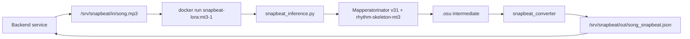

# SnapBeat inference — deploy runbook (Option A: Dockerized CLI)

This document is the handoff artifact for the backend team. It covers everything
needed to build and run the SnapBeat inference image on a GPU host, end to end.

The deliverable is a self-contained Docker image that converts an audio file
into a SnapBeat JSON chart. No HTTP server, no long-running process — one
`docker run` per request, stateless.

---

## 1. What you are receiving from the model team

| Item | Source | Notes |
|---|---|---|
| Source code + `Dockerfile.deploy` | GitHub repo `lukasnorland/Mapperatorinator`, branch `amaremix` | Pin to a specific commit SHA for reproducible builds (see §3). |
| HuggingFace token (`HF_TOKEN`) | Shared privately (1Password / Vault / ticket) | Fine-grained, scoped to `Read` on `lukasnorland/rhythm-skeleton-mt3` only. Required at **build** time; not needed at runtime. |
| Smoke-test stdout | Attached to handoff ticket | Proves the image produces valid SnapBeat JSON on a known input. |

---

## 2. Host prerequisites

The GPU host that **builds** and the GPU host that **runs** can be the same
machine or two different machines. Both need:

- Linux x86_64 (tested on Ubuntu 24.04).
- NVIDIA GPU with ≥ 12 GB VRAM for default settings. Smaller GPUs work with
  `max_batch_size=2` (see §7).
- NVIDIA driver ≥ 550.
- Docker Engine ≥ 24 with BuildKit enabled (default on 23+).
- `nvidia-container-toolkit` installed and configured for the Docker runtime.

Verification commands:

```bash
docker version --format '{{.Server.Version}}'              # expect >= 24
docker buildx version                                       # expect installed
nvidia-smi                                                  # expect a GPU row
docker run --rm --gpus all nvidia/cuda:12.4.0-base-ubuntu22.04 nvidia-smi
# The last line must print the same GPU row from inside a container.
```

If the last line fails, install `nvidia-container-toolkit` following
<https://docs.nvidia.com/datacenter/cloud-native/container-toolkit/latest/install-guide.html>
and restart Docker.

---

## 3. One-time setup

```bash
git clone git@github.com:lukasnorland/Mapperatorinator.git
cd Mapperatorinator
git checkout amaremix
# Optional but recommended: pin to the exact commit the model team built from.
# git checkout <commit-sha-from-handoff-ticket>
```

Store the HuggingFace token in your environment or secrets manager — **not in
git**. For a dev box:

```bash
# One-liner for an ad-hoc build. Do NOT commit this file.
export HF_TOKEN=hf_xxx_from_handoff
```

For CI, place the token in your secret store (GitHub Actions `secrets.HF_TOKEN`,
AWS Secrets Manager, etc.) and export it into the build job environment.

---

## 4. Build

```bash
DOCKER_BUILDKIT=1 docker build \
  -f Dockerfile.deploy \
  --secret id=hf_token,env=HF_TOKEN \
  -t snapbeat-lora:mt3-1 .
```

- `--secret id=hf_token,env=HF_TOKEN` mounts the token on a tmpfs inside a
  single `RUN` step and **never writes it to a layer**. You can verify after
  the build with:
  ```bash
  docker history --no-trunc snapbeat-lora:mt3-1 | grep -oE 'hf_[A-Za-z0-9]{30,}' \
    && echo "LEAK" || echo "CLEAN"
  ```
  Expected output: `CLEAN`.
- First build is ~20–30 minutes (flash-attn compile dominates, ~15 min).
  Subsequent builds with cached layers are ~30 seconds unless the code
  changes significantly.
- Final image size is ~10 GB on disk (~3.9 GB base + deps, ~1 GB LoRA + base
  model weights, ~0.1 GB app code, plus overhead).

Tag scheme: `snapbeat-lora:<game_code>-<revision>`. Bump the revision when
dependencies or the Dockerfile change. When a new LoRA ships (e.g. BH), use
`bh-1`.

---

## 5. Run

```bash
mkdir -p /srv/snapbeat/in /srv/snapbeat/out
# Place the audio file at /srv/snapbeat/in/<name>.mp3, then:

docker run --rm --gpus all \
  -v /srv/snapbeat/in:/in:ro \
  -v /srv/snapbeat/out:/out \
  snapbeat-lora:mt3-1 \
  audio_path=/in/song.mp3 output_path=/out
```

Output: `/srv/snapbeat/out/<audio_stem>_snapbeat.json`.

The container runs as uid `10001`. If you get `PermissionError` writing to
`/out`, fix the host directory with `sudo chown 10001:10001 /srv/snapbeat/out`.

---

## 6. CLI overrides (Hydra)

Everything after the image name is passed straight to `snapbeat_inference.py`
as a Hydra override (`key=value`, no dashes).

| Override | Default | Purpose |
|---|---|---|
| `audio_path` | *(required)* | Absolute path inside the container. Use `/in/...`. |
| `output_path` | *(required)* | Absolute path inside the container. Use `/out`. |
| `game_code` | `MT3` | Selects the LoRA automatically. Must be one of `MT3`, `BH`, `DR`. Only `MT3` has a LoRA registered at the moment. |
| `lora_path` | *(auto from `game_code`)* | Explicit HF repo or local path. Overrides the `game_code` registry. Passing a private HF repo here requires `HF_TOKEN` at runtime. |
| `difficulty` | *none* | Float 0.0–10.0, star-rating condition. |
| `seed` | *none* | Int, deterministic generation. |
| `precision` | `fp32` | `fp32` / `bf16` / `amp`. `bf16` is faster on A100/H100/Ada cards. |
| `attn_implementation` | `auto` | `auto` / `flash_attention_2` / `sdpa` / `eager`. Set to `sdpa` if flash-attn misbehaves (see §9). |
| `max_batch_size` | `8` | Lower to `2` on 8 GB VRAM cards. Higher on A100s. |

Example with overrides:

```bash
docker run --rm --gpus all \
  -v /srv/snapbeat/in:/in:ro -v /srv/snapbeat/out:/out \
  snapbeat-lora:mt3-1 \
  audio_path=/in/song.mp3 output_path=/out \
  difficulty=5.0 seed=42 precision=bf16
```

---

## 7. Exit codes

| Code | Meaning | Action |
|---|---|---|
| `0` | JSON written successfully | Read `/out/<stem>_snapbeat.json` and serve it. |
| `1` | Inference produced no notes | Usually means audio is silence/corrupt. Validate the audio file and retry. |
| `2` | Invalid `game_code` | Check the override; must be `MT3`, `BH`, or `DR`. |
| `3` | Valid `game_code` but no LoRA registered for it | Ask the model team to register a LoRA (e.g. BH, DR). |
| non-zero other | Runtime error (OOM, corrupt audio, bad Hydra override, etc.) | See stderr. Common causes in §9. |

Parse the exit code in your backend to decide whether to retry, surface an
error to the caller, or page on-call.

---

## 8. Resource expectations

| Metric | Typical | Notes |
|---|---|---|
| VRAM peak | ~5–7 GB | At `max_batch_size=8`, `precision=fp32`. Use `max_batch_size=2` on 8 GB cards. |
| Wall time | 30–80 s per 3-minute song | Includes ~10–20 s of fixed model-load overhead. |
| CPU | 2 cores | Model is GPU-bound; CPU is for audio decode + tokenization. |
| RAM | 4–6 GB | |
| Disk per run | ~100 KB | The JSON is tiny; intermediate `.osu` is also small. |
| Image size | ~10 GB | One-time cost per host. |
| Build time | ~20–30 min fresh / ~30 s cached | flash-attn compile dominates a fresh build. |

For ~12 inferences/day the container is idle 99 % of the time. A single
mid-range GPU host (e.g. A10G, RTX A2000, RTX 4070) is plenty.

---

## 9. Troubleshooting

**`PermissionError: /out`**
The container runs as uid `10001`. Run `sudo chown 10001:10001 /srv/snapbeat/out`
on the host.

**`torch.cuda.OutOfMemoryError` or driver-side OOM**
Lower the batch size: append `max_batch_size=2` (or `1`) to the `docker run`
command. If still OOM, try `precision=fp16` or `attn_implementation=sdpa`.

**`flash-attn` crashes or produces NaN**
Fall back to stock attention: `precision=fp32 attn_implementation=sdpa`.
Usually happens on older drivers or non-Ampere/Ada GPUs.

**`403 Forbidden` during build from HuggingFace**
The `HF_TOKEN` lacks read access to `lukasnorland/rhythm-skeleton-mt3`. The
token must be a fine-grained token with **Read** on that specific repo. The
classic "read all public repos" tokens will NOT work on a private repo.

**`ConfigKeyError: Key 'X' not in 'InferenceConfig'`**
An override name is wrong. Only keys listed in §6 (plus standard
Mapperatorinator inference keys) are recognized. Typos in Hydra overrides
surface as this error, not as silent ignores.

**Output JSON has `format: "MT3"` but the wrong game code is needed**
`game_code=MT3` is the only registered LoRA right now. Pass
`game_code=BH` or `game_code=DR` once the model team ships those LoRAs; until
then, these exit with code `3`.

**Output JSON appears nowhere on the host**
Check you are passing an **absolute** `output_path` (`/out`, not `./out`).
Hydra changes the working directory inside the container on startup, so
relative paths silently land in a `logs/...` subdir.

**Filenames with spaces / non-ASCII characters**
The JSON's `audioPath` field is the basename of the input path. Sanitize the
audio filename (e.g. snake_case, ASCII) on the backend before calling the
container.

---

## 10. Upgrade process

### Code or dependency bump (model team pushes new commit on `amaremix`)

```bash
cd Mapperatorinator
git fetch origin
git checkout amaremix
git pull --ff-only
# Rebuild with an incremented tag
DOCKER_BUILDKIT=1 docker build \
  -f Dockerfile.deploy --secret id=hf_token,env=HF_TOKEN \
  -t snapbeat-lora:mt3-2 .
# Point the backend at :mt3-2; roll back to :mt3-1 if needed.
```

### New LoRA (e.g. BH LoRA ships)

The model team will land a commit that adds `"BH": "lukasnorland/rhythm-skeleton-bh"`
to `_GAME_CODE_REGISTRY` in `snapbeat_inference.py`. After `git pull`, rebuild
with the new `LORA_REPO` baked in:

```bash
DOCKER_BUILDKIT=1 docker build \
  -f Dockerfile.deploy --secret id=hf_token,env=HF_TOKEN \
  --build-arg LORA_REPO=lukasnorland/rhythm-skeleton-bh \
  -t snapbeat-lora:bh-1 .
```

Then at runtime add `game_code=BH` to pick up the new LoRA.

### Rotating the HuggingFace token

Swap the environment variable and rebuild. The token is only embedded during
a single `RUN` step via BuildKit secret, so no changes to the image are
needed — just re-run the build with the new `HF_TOKEN`.

---

## 11. Data flow



---

## 12. Security notes

- The image embeds the private `rhythm-skeleton-mt3` LoRA weights. If you
  push the built image to an internal registry, the registry repository
  **must be private**. Anyone with `docker pull` access can extract weights
  with `docker save`.
- The `HF_TOKEN` is required only at build time. Do not set `HF_TOKEN` on the
  runtime host unless you override `lora_path=` with a private repo at runtime.
- The container runs as non-root uid `10001`. Keep it that way; do not pass
  `--user 0` at runtime.
- No network access is required at runtime once the image is built. You can
  run the container in an air-gapped environment. Set `docker run --network=none`
  if your environment requires it.

---

## 13. Contact

For model / inference issues: ping the model team (repo maintainer
`lukasnorland`).
For all container / deployment issues: backend team (this document).

Smoke-test command used at handoff (reference):

```bash
docker run --rm --gpus all \
  -v "$PWD/test:/in:ro" -v "$PWD/out:/out" \
  snapbeat-lora:mt3-1 \
  audio_path=/in/demo.mp3 output_path=/out
# Exit code: 0
# Output: out/demo_snapbeat.json — valid JSON, format: "MT3", notes non-empty.
```
